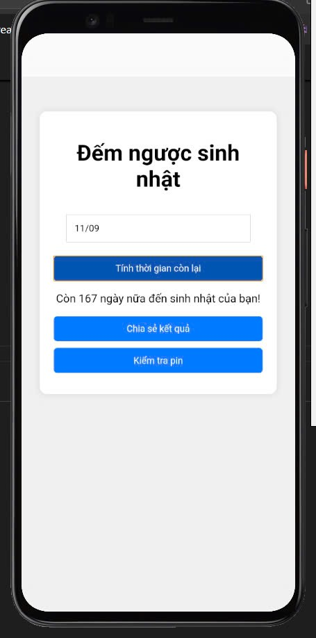
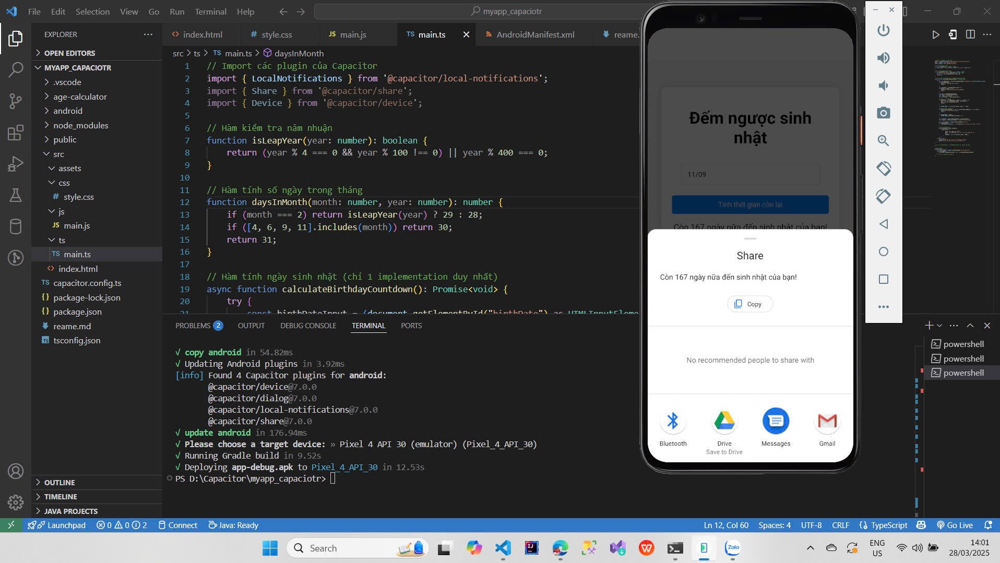

Các bước chạy chương trình
## Yêu cầu hệ thống
- Node.js 16+
- Android Studio (cho Android)
- Xcode (cho iOS)

## Cài đặt
1. Cài đặt dependencies:
```bash
npm install

#thêm nền tảng android
npx cap add android
npx cap add ios

#Chạy ứng dụng trên android
npm run build
npx cap sync android
npx cap open android
npx cap run android


## KẾT QUẢ CHẠY DỰ ÁN



